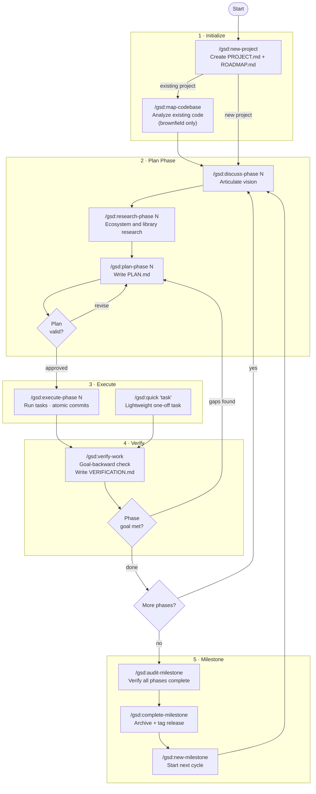
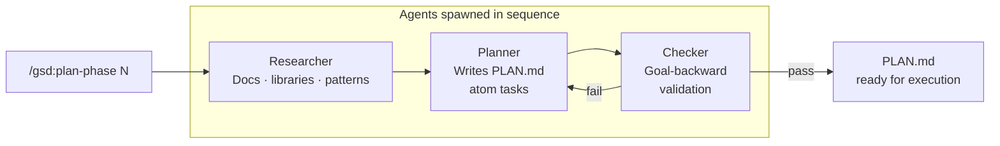
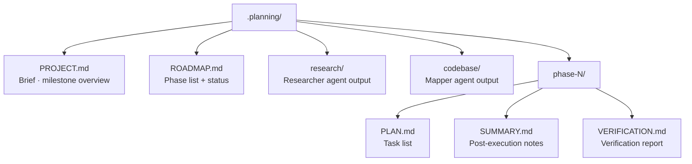

# GSD Workflow Diagram

## Full Project Lifecycle



---

## Phase Planning Detail



---

## Context & State Files



---

## Quick Command Cheatsheet

```
Init         /gsd:new-project  →  /gsd:map-codebase (brownfield)
Plan         /gsd:discuss-phase N  →  /gsd:plan-phase N
Execute      /gsd:execute-phase N  (or /gsd:quick "task")
Verify       /gsd:verify-work
Navigate     /gsd:progress  ·  /gsd:resume-work  ·  /gsd:pause-work
Roadmap      /gsd:add-phase  ·  /gsd:insert-phase  ·  /gsd:remove-phase
Milestone    /gsd:audit-milestone  →  /gsd:complete-milestone  →  /gsd:new-milestone
```
